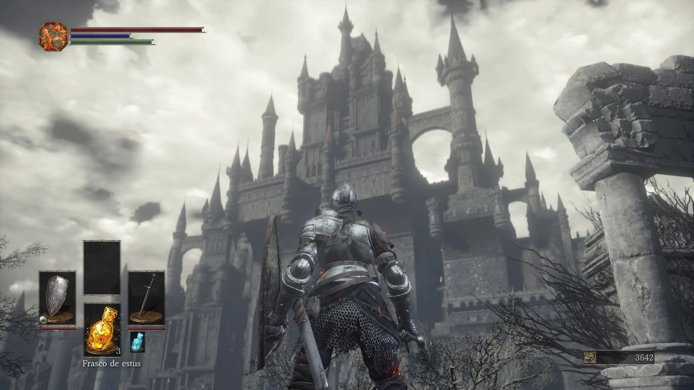

# ⚔️ Saga Dark Souls 🌑🔥

¡Bienvenido a **Dark Souls Page**!  
Este proyecto es una página web sencilla creada con **HTML5** y **CSS3** para rendir homenaje a la legendaria saga **Dark Souls** desarrollada por *FromSoftware*.  

---

## 🖼️ Vista previa del proyecto

### 🎨 Pantalla principal


### 🌌 Galería de imágenes


---

## 🚀 Características

✅ **Diseño responsivo** con tarjetas de cada juego.  
✅ **Efectos hover** en botones y tarjetas.  
✅ **Galería de imágenes** organizada en columnas.  
✅ **Header fijo** con navegación.  
✅ **Botón para volver al inicio**.  

---

## 📦 Tecnologías usadas

- 🌐 **HTML5**
- 🎨 **CSS3** (flexbox, grid, hover effects)
- 🏗️ **GitHub Pages** para el despliegue

---

## 📂 Estructura del proyecto

📁 DarkSoulsPage
┣ 📁 img
┃ ┣ Dark_Souls_1.webp
┃ ┣ Dark_Souls_2.webp
┃ ┣ Dark_Souls_3.webp
┃ ┣ gameplay1.jpg
┃ ┣ gameplay2.jpg
┃ ┣ gameplay3.jpg
┃ ┣ gameplay4.jpg
┃ ┣ gameplay5.jpg
┃ ┣ gameplay6.jpg
┃ ┣ gameplay7.jpg
┃ ┣ gameplay8.jpg
┃ ┗ gameplay9.jpg
┣ 📄 index.html
┣ 📄 styles.css
┗ 📄 README.md

yaml
Copiar
Editar

---

## ✨ Cómo verlo en vivo

Puedes visitar la página aquí:  
👉 **[🌍 Dark Souls Page en GitHub Pages](https://jhoncastrillon.github.io/DarkSoulsPage/)**  

---

## ✏️ Cómo clonar este proyecto

```bash
git clone https://github.com/JhonCastrillon/DarkSoulsPage.git
cd DarkSoulsPage
Abre el archivo index.html en tu navegador y ¡listo! 🎉

🙌 Créditos
👨‍💻 Desarrollado por Jhon Castrillón
🎮 Imágenes y recursos inspirados en la saga Dark Souls de FromSoftware.

🔥 May the flame guide thee. 🔥
